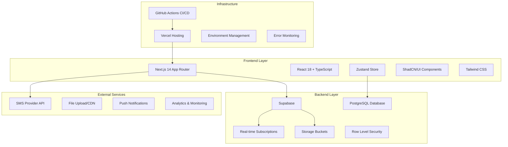

# 🏗️ 드라이빙존 미션 시스템 - 기술 아키텍처 & 컴포넌트 설계

## 🎯 아키텍처 핵심 원칙

### "Scalable Gamification Architecture"
> **확장 가능한 게이미피케이션 아키텍처**로 사용자 경험과 기술적 안정성을 동시에 확보

---

## 🏛️ 전체 시스템 아키텍처

### **High-Level Architecture**


---

## 🧩 컴포넌트 아키텍처 설계

### **Atomic Design System**
```typescript
// 📦 Atoms: 가장 기본적인 UI 요소들
interface AtomicComponents {
  atoms: {
    Button: React.FC<ButtonProps>;
    Input: React.FC<InputProps>;
    Badge: React.FC<BadgeProps>;
    Avatar: React.FC<AvatarProps>;
    Icon: React.FC<IconProps>;
    Spinner: React.FC<SpinnerProps>;
  };
  
  molecules: {
    FormField: React.FC<FormFieldProps>;
    MissionCard: React.FC<MissionCardProps>;
    ProgressBar: React.FC<ProgressBarProps>;
    PaybackDisplay: React.FC<PaybackDisplayProps>;
    NotificationToast: React.FC<ToastProps>;
  };
  
  organisms: {
    MissionGrid: React.FC<MissionGridProps>;
    DashboardHeader: React.FC<HeaderProps>;
    UserProfile: React.FC<ProfileProps>;
    PaybackSummary: React.FC<SummaryProps>;
    NavigationMenu: React.FC<NavigationProps>;
  };
  
  templates: {
    DashboardLayout: React.FC<LayoutProps>;
    MissionLayout: React.FC<MissionLayoutProps>;
    AuthLayout: React.FC<AuthLayoutProps>;
  };
  
  pages: {
    Dashboard: React.FC;
    MissionDetails: React.FC<MissionDetailsProps>;
    UserProfile: React.FC;
    PaybackHistory: React.FC;
  };
}
```

### **Smart Component Architecture**
```typescript
// 🧠 Smart Components: 비즈니스 로직 + 상태 관리
interface SmartComponents {
  // 미션 관련 스마트 컴포넌트
  MissionController: {
    component: React.FC<MissionControllerProps>;
    responsibilities: [
      "미션 상태 관리",
      "진행도 추적",
      "보상 계산",
      "실시간 업데이트"
    ];
  };
  
  // 사용자 관련 스마트 컴포넌트
  UserController: {
    component: React.FC<UserControllerProps>;
    responsibilities: [
      "인증 상태 관리",
      "프로필 정보 동기화",
      "권한 검증",
      "세션 관리"
    ];
  };
  
  // 페이백 관련 스마트 컴포넌트
  PaybackController: {
    component: React.FC<PaybackControllerProps>;
    responsibilities: [
      "페이백 계산 로직",
      "보상 지급 상태 추적",
      "통계 데이터 생성",
      "알림 트리거"
    ];
  };
}

// 🎨 Dumb Components: 순수 UI 컴포넌트
interface DumbComponents {
  // 재사용 가능한 순수 UI 컴포넌트들
  MissionCardView: React.FC<{
    mission: Mission;
    progress: number;
    onAction: (action: MissionAction) => void;
  }>;
  
  ProgressRing: React.FC<{
    progress: number;
    size: 'sm' | 'md' | 'lg';
    showValue: boolean;
    animated: boolean;
  }>;
  
  PaybackCounter: React.FC<{
    amount: number;
    currency: string;
    animationType: 'countUp' | 'slide' | 'bounce';
  }>;
}
```

---

## 🗄️ 데이터 계층 설계

### **Database Schema Optimization**
```sql
-- 🎯 성능 최적화된 테이블 설계
CREATE TABLE users (
    id UUID DEFAULT gen_random_uuid() PRIMARY KEY,
    name VARCHAR(50) NOT NULL,
    phone VARCHAR(15) UNIQUE NOT NULL,
    phone_verified BOOLEAN DEFAULT false,
    level INTEGER DEFAULT 1,
    experience_points INTEGER DEFAULT 0,
    total_payback INTEGER DEFAULT 0,
    created_at TIMESTAMP DEFAULT now(),
    updated_at TIMESTAMP DEFAULT now(),
    
    -- 인덱스 최적화
    INDEX idx_phone (phone),
    INDEX idx_level_exp (level, experience_points),
    INDEX idx_created_at (created_at)
);

-- 🎮 게이미피케이션을 위한 확장 테이블들
CREATE TABLE user_achievements (
    id UUID DEFAULT gen_random_uuid() PRIMARY KEY,
    user_id UUID REFERENCES users(id) ON DELETE CASCADE,
    achievement_id VARCHAR(50) NOT NULL,
    unlocked_at TIMESTAMP DEFAULT now(),
    
    UNIQUE(user_id, achievement_id),
    INDEX idx_user_achievements (user_id, unlocked_at)
);

CREATE TABLE user_streaks (
    id UUID DEFAULT gen_random_uuid() PRIMARY KEY,
    user_id UUID REFERENCES users(id) ON DELETE CASCADE,
    streak_type VARCHAR(20) NOT NULL, -- 'daily_login', 'mission_complete'
    current_count INTEGER DEFAULT 0,
    max_count INTEGER DEFAULT 0,
    last_activity DATE,
    
    UNIQUE(user_id, streak_type),
    INDEX idx_user_streaks (user_id, streak_type)
);

-- 📊 실시간 분석을 위한 이벤트 테이블
CREATE TABLE user_events (
    id UUID DEFAULT gen_random_uuid() PRIMARY KEY,
    user_id UUID REFERENCES users(id) ON DELETE CASCADE,
    event_type VARCHAR(50) NOT NULL,
    event_data JSONB,
    created_at TIMESTAMP DEFAULT now(),
    
    INDEX idx_user_events_type (user_id, event_type, created_at),
    INDEX idx_events_time (created_at)
);
```

### **Supabase Integration Layer**
```typescript
// 🔧 Database Abstraction Layer
export class DatabaseService {
  private supabase = createClientComponentClient<Database>();
  
  // 🎯 Mission Operations
  async getMissionProgress(userId: string): Promise<MissionProgress[]> {
    const { data, error } = await this.supabase
      .from('user_missions')
      .select(`
        *,
        missions:mission_id (
          title,
          description,
          reward_amount,
          mission_type
        )
      `)
      .eq('user_id', userId)
      .order('created_at', { ascending: true });
      
    if (error) throw new DatabaseError('Failed to fetch mission progress', error);
    return this.transformMissionData(data);
  }
  
  // 🏆 Achievement System
  async unlockAchievement(userId: string, achievementId: string): Promise<void> {
    const { error } = await this.supabase.rpc('unlock_achievement', {
      p_user_id: userId,
      p_achievement_id: achievementId
    });
    
    if (error) throw new DatabaseError('Failed to unlock achievement', error);
    
    // 실시간 알림 트리거
    this.triggerAchievementNotification(userId, achievementId);
  }
  
  // 📈 Real-time Subscriptions
  subscribeToUserProgress(userId: string, callback: (data: any) => void) {
    return this.supabase
      .channel(`user_progress:${userId}`)
      .on('postgres_changes', {
        event: 'UPDATE',
        schema: 'public',
        table: 'user_missions',
        filter: `user_id=eq.${userId}`
      }, callback)
      .subscribe();
  }
  
  // 💰 Payback Calculations
  async calculateTotalPayback(userId: string): Promise<PaybackSummary> {
    const { data, error } = await this.supabase.rpc('calculate_user_payback', {
      p_user_id: userId
    });
    
    if (error) throw new DatabaseError('Failed to calculate payback', error);
    return data;
  }
}
```

---

## 🔄 상태 관리 아키텍처

### **Zustand Store Architecture**
```typescript
// 🏪 모듈화된 스토어 설계
interface StoreModules {
  // 사용자 관련 상태
  userModule: {
    state: UserState;
    actions: UserActions;
    selectors: UserSelectors;
  };
  
  // 미션 관련 상태  
  missionModule: {
    state: MissionState;
    actions: MissionActions;
    selectors: MissionSelectors;
  };
  
  // UI 상태 관리
  uiModule: {
    state: UIState;
    actions: UIActions;
    selectors: UISelectors;
  };
  
  // 게이미피케이션 상태
  gamificationModule: {
    state: GamificationState;
    actions: GamificationActions;
    selectors: GamificationSelectors;
  };
}

// 🎯 High-Performance Store Implementation
export const useAppStore = create<AppStore>()(
  subscribeWithSelector(
    persist(
      immer((set, get) => ({
        // 🔥 Optimized state updates with Immer
        updateMissionProgress: (missionId: number, progress: Partial<UserMission>) => {
          set((state) => {
            const missionIndex = state.userMissions.findIndex(m => m.missionId === missionId);
            if (missionIndex !== -1) {
              state.userMissions[missionIndex] = { 
                ...state.userMissions[missionIndex], 
                ...progress 
              };
            }
          });
        },
        
        // 🎮 Gamification state updates
        addExperience: (amount: number, source: ExperienceSource) => {
          set((state) => {
            const newExp = state.user.experiencePoints + amount;
            const newLevel = calculateLevel(newExp);
            
            state.user.experiencePoints = newExp;
            
            // 레벨업 검사 및 처리
            if (newLevel > state.user.level) {
              state.user.level = newLevel;
              state.notifications.push({
                type: 'level_up',
                message: `레벨 ${newLevel}에 도달했습니다!`,
                timestamp: new Date().toISOString()
              });
            }
            
            // 이벤트 기록
            state.events.push({
              type: 'experience_gained',
              data: { amount, source, newTotal: newExp },
              timestamp: new Date().toISOString()
            });
          });
        }
      })),
      {
        name: 'driving-zone-store',
        partialize: (state) => ({
          user: state.user,
          settings: state.settings
        })
      }
    )
  )
);
```

### **Real-time State Synchronization**
```typescript
// 🔄 실시간 데이터 동기화 시스템
export class RealtimeSync {
  private subscriptions = new Map<string, RealtimeChannel>();
  
  // 사용자별 실시간 구독 설정
  setupUserSync(userId: string) {
    const channel = supabase.channel(`user:${userId}`);
    
    // 미션 진행도 실시간 업데이트
    channel.on('postgres_changes', {
      event: 'UPDATE',
      schema: 'public',
      table: 'user_missions',
      filter: `user_id=eq.${userId}`
    }, (payload) => {
      useAppStore.getState().syncMissionProgress(payload.new);
    });
    
    // 페이백 상태 실시간 업데이트
    channel.on('postgres_changes', {
      event: 'INSERT',
      schema: 'public', 
      table: 'paybacks',
      filter: `user_id=eq.${userId}`
    }, (payload) => {
      useAppStore.getState().addPayback(payload.new);
      this.triggerPaybackNotification(payload.new);
    });
    
    // 친구 활동 알림
    channel.on('broadcast', { event: 'friend_activity' }, (payload) => {
      useAppStore.getState().addFriendActivity(payload);
    });
    
    channel.subscribe();
    this.subscriptions.set(userId, channel);
  }
  
  // 구독 정리
  cleanup(userId: string) {
    const channel = this.subscriptions.get(userId);
    if (channel) {
      channel.unsubscribe();
      this.subscriptions.delete(userId);
    }
  }
}
```

---

## 🎨 UI 컴포넌트 시스템

### **Advanced Component Patterns**
```typescript
// 🔧 Compound Components Pattern
export const MissionCard = {
  Root: ({ children, mission, ...props }: MissionCardRootProps) => (
    <div className="mission-card" data-mission-id={mission.id} {...props}>
      <MissionContext.Provider value={mission}>
        {children}
      </MissionContext.Provider>
    </div>
  ),
  
  Header: ({ children }: { children: React.ReactNode }) => (
    <div className="mission-card-header">
      {children}
    </div>
  ),
  
  Title: () => {
    const mission = useMissionContext();
    return <h3 className="mission-title">{mission.title}</h3>;
  },
  
  Progress: ({ showPercentage = true }: { showPercentage?: boolean }) => {
    const mission = useMissionContext();
    const progress = useMissionProgress(mission.id);
    
    return (
      <ProgressRing 
        progress={progress} 
        showValue={showPercentage}
        animated={true}
      />
    );
  },
  
  Actions: ({ children }: { children: React.ReactNode }) => (
    <div className="mission-card-actions">
      {children}
    </div>
  ),
  
  Reward: () => {
    const mission = useMissionContext();
    return (
      <div className="mission-reward">
        <PaybackAmount amount={mission.rewardAmount} />
      </div>
    );
  }
};

// 사용 예시
const MissionCardExample = () => (
  <MissionCard.Root mission={mission}>
    <MissionCard.Header>
      <MissionCard.Title />
      <MissionCard.Progress />
    </MissionCard.Header>
    <MissionCard.Reward />
    <MissionCard.Actions>
      <Button onClick={startMission}>시작하기</Button>
    </MissionCard.Actions>
  </MissionCard.Root>
);
```

### **Render Props & Custom Hooks**
```typescript
// 🎣 Advanced Custom Hooks
export const useMissionManager = (missionId: number) => {
  const [status, setStatus] = useState<MissionStatus>('pending');
  const [progress, setProgress] = useState(0);
  const [error, setError] = useState<string | null>(null);
  
  // 미션 시작
  const startMission = useCallback(async () => {
    try {
      setStatus('in_progress');
      await missionService.startMission(missionId);
      
      // 실시간 진행도 추적 시작
      const subscription = supabase
        .channel(`mission:${missionId}`)
        .on('postgres_changes', {
          event: 'UPDATE',
          schema: 'public',
          table: 'user_missions',
          filter: `mission_id=eq.${missionId}`
        }, (payload) => {
          setProgress(payload.new.progress || 0);
          if (payload.new.status === 'completed') {
            setStatus('completed');
            triggerSuccessAnimation();
          }
        })
        .subscribe();
        
      return () => subscription.unsubscribe();
    } catch (err) {
      setError(err.message);
      setStatus('failed');
    }
  }, [missionId]);
  
  // 미션 완료 처리
  const completeMission = useCallback(async (proofData: any) => {
    try {
      await missionService.completeMission(missionId, proofData);
      setStatus('completed');
      setProgress(100);
      
      // 성취 애니메이션 트리거
      await playSuccessAnimation();
      
      // 페이백 계산 및 업데이트
      const payback = await paybackService.calculatePayback(missionId);
      useAppStore.getState().addPayback(payback);
      
    } catch (err) {
      setError(err.message);
    }
  }, [missionId]);
  
  return {
    status,
    progress,
    error,
    startMission,
    completeMission,
    isLoading: status === 'in_progress',
    isCompleted: status === 'completed'
  };
};

// 🎯 Render Props Component
export const MissionProvider = ({ 
  missionId, 
  children 
}: {
  missionId: number;
  children: (props: MissionProviderProps) => React.ReactNode;
}) => {
  const missionManager = useMissionManager(missionId);
  const mission = useMission(missionId);
  
  return (
    <>
      {children({
        mission,
        ...missionManager
      })}
    </>
  );
};
```

---

## 🚀 성능 최적화 전략

### **Code Splitting & Lazy Loading**
```typescript
// 📦 Route-based Code Splitting
const Dashboard = lazy(() => import('@/pages/Dashboard'));
const MissionDetails = lazy(() => import('@/pages/MissionDetails'));
const PaybackHistory = lazy(() => import('@/pages/PaybackHistory'));

// 🎯 Component-based Code Splitting
const HeavyChart = lazy(() => import('@/components/charts/PaybackChart'));
const AdvancedUploader = lazy(() => import('@/components/upload/AdvancedUploader'));

// 💡 Smart Preloading Strategy
export const useSmartPreload = () => {
  const { pathname } = useRouter();
  
  useEffect(() => {
    // 현재 페이지에 따른 예상 다음 페이지 preload
    const preloadMap = {
      '/dashboard': ['/missions/challenge', '/payback'],
      '/missions': ['/missions/[id]', '/dashboard'],
      '/register': ['/dashboard']
    };
    
    const nextRoutes = preloadMap[pathname];
    nextRoutes?.forEach(route => {
      router.prefetch(route);
    });
  }, [pathname]);
};
```

### **Memory Management & Optimization**
```typescript
// 🧠 Memory-efficient State Updates
const useOptimizedMissionList = () => {
  const missions = useAppStore((state) => state.missions);
  
  // 큰 리스트의 메모리 사용량 최적화
  const virtualizedMissions = useMemo(() => {
    return missions.slice(0, VISIBLE_MISSION_COUNT);
  }, [missions]);
  
  // 무거운 계산 결과 캐싱
  const missionStats = useMemo(() => {
    return calculateMissionStatistics(missions);
  }, [missions]);
  
  // 불필요한 리렌더링 방지
  const stableMissionActions = useCallback((missionId: number) => ({
    start: () => startMission(missionId),
    complete: (data: any) => completeMission(missionId, data),
    cancel: () => cancelMission(missionId)
  }), []);
  
  return {
    missions: virtualizedMissions,
    stats: missionStats,
    actions: stableMissionActions
  };
};

// 🔄 Optimized Re-rendering with React.memo
export const MissionCard = React.memo(({ 
  mission, 
  onAction 
}: MissionCardProps) => {
  // 컴포넌트 로직...
}, (prevProps, nextProps) => {
  // 커스텀 비교 함수로 불필요한 리렌더링 방지
  return (
    prevProps.mission.id === nextProps.mission.id &&
    prevProps.mission.status === nextProps.mission.status &&
    prevProps.mission.progress === nextProps.mission.progress
  );
});
```

---

## 🔒 보안 아키텍처

### **Row Level Security (RLS) Policies**
```sql
-- 🛡️ 사용자 데이터 보안 정책
CREATE POLICY "Users can only access own data" ON users
    FOR ALL USING (auth.uid() = id);

CREATE POLICY "Users can only see own missions" ON user_missions
    FOR ALL USING (auth.uid() = user_id);

CREATE POLICY "Users can only access own paybacks" ON paybacks
    FOR ALL USING (auth.uid() = user_id);

-- 🔐 관리자 전용 정책
CREATE POLICY "Admin full access" ON admin_actions
    FOR ALL USING (
        EXISTS (
            SELECT 1 FROM admin_users 
            WHERE user_id = auth.uid() AND is_active = true
        )
    );
```

### **Client-Side Security**
```typescript
// 🔒 API Request Security Layer
class SecureApiClient {
  private headers = {
    'Content-Type': 'application/json',
    'X-Client-Version': process.env.NEXT_PUBLIC_APP_VERSION,
  };
  
  async request<T>(endpoint: string, options: RequestOptions = {}): Promise<T> {
    // Request validation
    this.validateRequest(endpoint, options);
    
    // Rate limiting check
    await this.checkRateLimit(endpoint);
    
    // Add security headers
    const secureHeaders = {
      ...this.headers,
      'X-CSRF-Token': await this.getCSRFToken(),
      'Authorization': `Bearer ${await this.getValidToken()}`
    };
    
    const response = await fetch(endpoint, {
      ...options,
      headers: { ...secureHeaders, ...options.headers }
    });
    
    // Response validation
    this.validateResponse(response);
    
    return response.json();
  }
  
  private validateRequest(endpoint: string, options: RequestOptions) {
    // SQL injection prevention
    if (typeof options.body === 'string') {
      const suspiciousPatterns = /(\bUNION\b|\bSELECT\b|\bDROP\b|\bDELETE\b)/i;
      if (suspiciousPatterns.test(options.body)) {
        throw new SecurityError('Suspicious request detected');
      }
    }
    
    // XSS prevention
    if (options.body && typeof options.body === 'object') {
      this.sanitizeObject(options.body);
    }
  }
}
```

---

## 📊 모니터링 & 분석 시스템

### **Real-time Analytics Integration**
```typescript
// 📈 Event Tracking System
export class AnalyticsService {
  private eventQueue: AnalyticsEvent[] = [];
  private flushInterval = 5000; // 5초마다 배치 전송
  
  // 사용자 행동 추적
  trackUserAction(action: UserAction, metadata?: Record<string, any>) {
    const event: AnalyticsEvent = {
      type: 'user_action',
      action: action.type,
      userId: action.userId,
      timestamp: new Date().toISOString(),
      metadata: {
        ...metadata,
        page: window.location.pathname,
        userAgent: navigator.userAgent,
        sessionId: this.getSessionId()
      }
    };
    
    this.queueEvent(event);
    
    // 중요 이벤트는 즉시 전송
    if (action.type === 'mission_completed' || action.type === 'payback_received') {
      this.flushEvents();
    }
  }
  
  // 성능 메트릭 추적
  trackPerformance(metric: PerformanceMetric) {
    const event: AnalyticsEvent = {
      type: 'performance',
      data: {
        metric: metric.name,
        value: metric.value,
        timestamp: performance.now()
      }
    };
    
    this.queueEvent(event);
  }
  
  // 에러 추적
  trackError(error: Error, context?: string) {
    const event: AnalyticsEvent = {
      type: 'error',
      data: {
        message: error.message,
        stack: error.stack,
        context,
        url: window.location.href,
        timestamp: new Date().toISOString()
      }
    };
    
    // 에러는 즉시 전송
    this.sendEvent(event);
  }
  
  private async flushEvents() {
    if (this.eventQueue.length === 0) return;
    
    const events = this.eventQueue.splice(0);
    
    try {
      await fetch('/api/analytics', {
        method: 'POST',
        headers: { 'Content-Type': 'application/json' },
        body: JSON.stringify({ events })
      });
    } catch (error) {
      console.error('Failed to send analytics events:', error);
      // 실패한 이벤트들을 다시 큐에 추가 (최대 재시도 횟수 제한)
      this.eventQueue.unshift(...events.slice(-10)); // 최근 10개만 보관
    }
  }
}
```

### **Error Boundary & Monitoring**
```typescript
// 🚨 Advanced Error Boundary
export class ErrorBoundary extends React.Component<
  ErrorBoundaryProps,
  ErrorBoundaryState
> {
  constructor(props: ErrorBoundaryProps) {
    super(props);
    this.state = { hasError: false, error: null, errorInfo: null };
  }
  
  static getDerivedStateFromError(error: Error): ErrorBoundaryState {
    return { hasError: true, error, errorInfo: null };
  }
  
  componentDidCatch(error: Error, errorInfo: React.ErrorInfo) {
    // 에러 정보 상세 로깅
    const errorDetails = {
      error: error.message,
      stack: error.stack,
      componentStack: errorInfo.componentStack,
      timestamp: new Date().toISOString(),
      userAgent: navigator.userAgent,
      url: window.location.href,
      userId: useAppStore.getState().user?.id
    };
    
    // 에러 모니터링 서비스에 전송
    this.reportError(errorDetails);
    
    this.setState({ errorInfo });
  }
  
  private async reportError(errorDetails: ErrorDetails) {
    try {
      // Sentry, LogRocket 등 에러 모니터링 서비스 연동
      await fetch('/api/errors', {
        method: 'POST',
        headers: { 'Content-Type': 'application/json' },
        body: JSON.stringify(errorDetails)
      });
    } catch (reportError) {
      console.error('Failed to report error:', reportError);
    }
  }
  
  render() {
    if (this.state.hasError) {
      return this.props.fallback || <DefaultErrorFallback />;
    }
    
    return this.props.children;
  }
}
```

---

## 🧪 테스트 아키텍처

### **Testing Strategy**
```typescript
// 🧪 Component Testing with React Testing Library
describe('MissionCard Component', () => {
  const mockMission: Mission = {
    id: 1,
    title: '재능충 챌린지',
    description: '14시간 이내 합격',
    rewardAmount: 20000,
    missionType: 'challenge',
    isActive: true
  };
  
  it('should display mission information correctly', () => {
    render(<MissionCard mission={mockMission} />);
    
    expect(screen.getByText('재능충 챌린지')).toBeInTheDocument();
    expect(screen.getByText('20,000원')).toBeInTheDocument();
    expect(screen.getByRole('button', { name: '시작하기' })).toBeInTheDocument();
  });
  
  it('should handle mission start action', async () => {
    const mockStartMission = jest.fn();
    render(<MissionCard mission={mockMission} onStart={mockStartMission} />);
    
    const startButton = screen.getByRole('button', { name: '시작하기' });
    fireEvent.click(startButton);
    
    expect(mockStartMission).toHaveBeenCalledWith(mockMission.id);
  });
});

// 🔧 Integration Testing
describe('Mission Flow Integration', () => {
  it('should complete full mission flow', async () => {
    const { container } = render(<App />);
    
    // 로그인
    await userEvent.type(screen.getByLabelText('휴대폰'), '01012345678');
    await userEvent.click(screen.getByRole('button', { name: '로그인' }));
    
    // 미션 시작
    await waitFor(() => screen.getByText('재능충 챌린지'));
    await userEvent.click(screen.getByRole('button', { name: '시작하기' }));
    
    // 미션 완료
    await userEvent.upload(screen.getByLabelText('합격증'), mockFile);
    await userEvent.click(screen.getByRole('button', { name: '제출' }));
    
    // 결과 확인
    await waitFor(() => 
      expect(screen.getByText('미션 완료!')).toBeInTheDocument()
    );
    expect(screen.getByText('20,000원이 적립되었습니다')).toBeInTheDocument();
  });
});
```

---

이 기술 아키텍처는 **확장성**, **성능**, **보안**, **유지보수성**을 모두 고려하여 설계되었으며, 게이미피케이션 요소를 효과적으로 지원할 수 있는 구조로 구성되어 있습니다. 🏗️✨